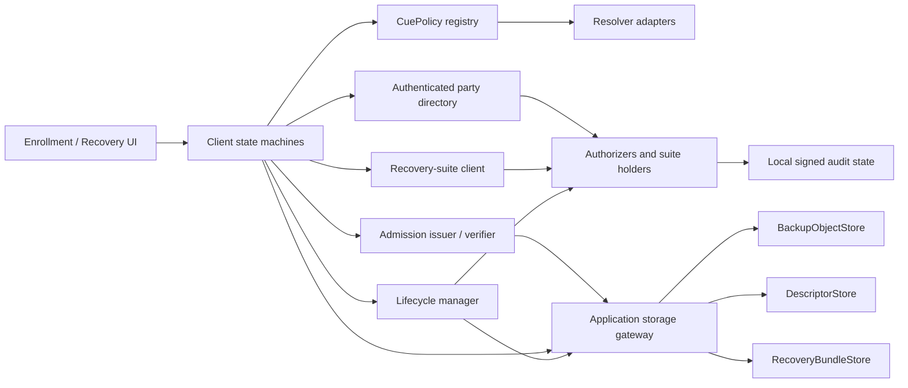

# Target Architecture

Status: owner-approved P1 target-design direction for D001, D003--D005,
D007--D010, and D014--D017. D015 supersedes D002 and D006. It does not
supersede the implemented baseline architecture or current manuscript until the affected
implementation/evidence gates and a separate exact manuscript delta are
approved by the owner.

P1.3 now implements the suite-neutral in-memory contract layer described here,
including a thin frozen-Yi compatibility adapter and typed CuePolicy/resolver
adapters. See `SYSTEM-INTERFACES.md`. Descriptor, admission, gateway, lifecycle,
and client-state-machine entries remain contracts only until their later
chronological phases implement and evaluate them.

P1.4 freezes the allocation rules and protected-identifier ledger in
`VERSION-REGISTRY.md` and `version-registry-v1.json`. Future architecture
families are reserved by decision and chronological schema gate, not assigned
usable identifiers in advance.

P1.5 completes the prospective six-phase/twelve-view information-flow matrix
and the schema-checked C01--C26 security contracts. These define later
implementation and evidence obligations without promoting unsupported claims.

## Design principle

Keep the cryptographic data path stable and build realistic system behavior
around it through explicit interfaces.

## Components

### Client core

Owns:

- enrollment and recovery state machines;
- local CuePolicy invocation;
- recovery-suite client phases through a suite-neutral interface;
- backup encryption/decryption;
- descriptor validation;
- threshold and epoch consistency;
- exact protected-key identity verification;
- lifecycle orchestration.

The UI never implements these operations independently.

### CuePolicy registry

Maps an immutable policy identifier to:

- accepted structured input;
- resolver requirements;
- validation;
- canonicalization;
- ambiguity and duplicate behavior;
- public version metadata;
- deterministic vectors.

The registry preserves `LOCUS-location-person-set-v1` byte-for-byte and adds
three owner-approved atomic policy families after their schemas receive new
identifiers:

- exactly three distinct quantized geographic coordinates;
- exactly three distinct canonical E.164 phone numbers; and
- exactly three distinct canonical constrained email addresses.

Direct-input forms of the three atomic policies use `NoResolver`. The frozen
composite location-person policy remains the resolver-backed reference example.

### Resolver adapters

Possible profiles:

- deterministic fixture;
- explicit `NoResolver` for direct coordinate, phone, and email input;
- local user-controlled records;
- separately approved external provider.

Resolver output never becomes a stored cue verifier.

### BackupObjectStore

Stores immutable canonical encrypted backup objects. The existing filesystem and
S3-compatible adapters form the reference contract.

### DescriptorStore

Stores immutable signed descriptors and an authenticated current pointer with
compare-and-swap semantics. It is distinct from backup storage because current
configuration changes across epochs.

### Application storage gateway

Validates the eventual D004/D015 proof-key-bound storage capability and maps
one exact authorized operation to the provider-neutral backup, descriptor,
current-pointer, or bundle interface. It exposes no bucket listing, retains no
client credential, and returns only bounded LOCUS failure categories. Provider
credentials remain server-side and are scoped to the application namespace.

### RecoveryBundleStore

Provides an optional physical packaging layer for account-scoped providers.
Each immutable bounded ZIP contains exactly the canonical backup object, signed
descriptor, and manifest for one epoch. The authenticated mutable current
pointer remains outside the ZIP. The descriptor binds the canonical backup
member; the pointer binds the provider-assigned bundle locator, exact uploaded
bundle, and descriptor, avoiding self-referential digest and locator cycles.

An application-operated S3 namespace may implement backup, descriptor, pointer,
and bundle operations in one admitted account scope. Their logical contracts,
decoders, failure categories, and lifecycle rules remain distinct. S3 access
control is not a descriptor trust root.

### Party directory

Provides authenticated service identity and endpoint information. It must be
rooted in trust outside any unauthenticated descriptor.

### Authorizers and recovery-suite holders

Every service is an authorizer. A configured subset additionally stores one
native recovery-suite state. The frozen Yi holder and planned D017 aPPSS holder
are disjoint adapters and state types. Authorization quorum and recovery
threshold remain separate.

### Admission

Authenticates and authorizes a client request independently from TPASS. The
default research path uses a deterministic local issuer; an external OIDC/DPoP
profile is optional.

The D004 profile also issues short-lived storage capabilities bound to
subject, backup identifier, object prefix, operation, client proof key, nonce,
and expiry. An application storage gateway validates the capability and
performs the exact S3 operation. Clients receive no provider credential and
need no personal AWS account. Direct S3 pre-signed bearer URLs are outside the
approved core profile.

### Lifecycle manager

Coordinates successor preparation, backup and descriptor publication,
activation, predecessor retirement, and eventual membership replacement.

## Recommended reference profiles

### Reproducible local profile

- deterministic local issuer;
- filesystem descriptor store;
- S3-compatible local backup store;
- fictional resolver fixture;
- same-host containers;
- 2-of-3 TPASS;
- first aPPSS evaluation at 2-of-3 after P5A implementation/cutover gates;
- five authorizers;
- no external accounts.

This profile also supplies a deterministic recovery-bundle and current-pointer
adapter so the complete bootstrap contract can be tested without Google
credentials.

### Clean-client multi-VM profile

- two isolated clients;
- separate VMs for cloud/descriptor roles and parties;
- distinct keys and storage;
- 2-of-3 and 3-of-5 variants;
- explicit network topology;
- synthetic data.

### Supplemental provider profile

- AWS S3 backup/descriptor/current-pointer/bundle profile;
- application-operated account-scoped namespace;
- application storage gateway and proof-key-bound short-lived capability;
- disposable research account;
- benign functional and performance operations;
- no reviewer credential requirement;
- no independent-administration or production claim.

## Architecture boundaries

- Provider choice must not change CuePolicy or recovery-suite semantics.
- Normal clients must not require bucket-list permission or a long-lived cloud
  credential.
- Physical bundle colocation must not collapse the immutable-backup,
  immutable-descriptor, and mutable-current-pointer contracts.
- UI choice must not change canonical bytes.
- Admission failure must not become a recovery-suite correctness result.
- A descriptor cannot introduce a local cue test.
- The selected admission issuer is an explicit availability prerequisite. The
  default profile uses the local synthetic issuer; an external identity account
  exists only in an optional separately versioned adapter profile.
- A global attempt authority is not mandatory core architecture.
- A multi-host deployment is not automatically independently administered.
