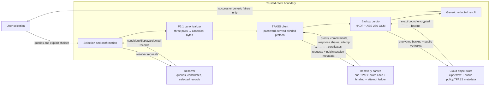

# LOCUS Cue Privacy Data Flow

Status: P3.9 reference data-flow diagram, 2026-07-21.

This diagram is normative for the implemented deterministic deployment. Solid
arrows name data that crosses a role boundary. The canonical descriptor, TPASS
password input, recovered group secret, wrapping key, and private key exist only
inside the client operation and must not appear in ordinary output or persistent
client state.

## Role-visible data

| Role | May observe/store | Must not receive or persist |
| --- | --- | --- |
| Client | resolver output during the operation; public backup/party messages; ephemeral canonical and key material | raw/canonical cues, TPASS password, recovered group secret, wrapping key, or recovered private key after the operation; prohibited material in logs/status/artifacts |
| Resolver | its own queries, candidates, selected records, timing, locale/account metadata according to its trust model | cloud ciphertext, party secret state, TPASS password, wrapping/private keys, recovery outcome |
| Cloud | encrypted backup, public policy/cipher-suite/TPASS parameters, backup/epoch identifiers, object timing/size | raw cues, resolver records/identifiers, cue hashes/verifiers, party state, recovered/group/wrapping/private keys |
| Each party | its own TPASS state, backup binding, authorization/attempt state, privacy-minimized audit events, authenticated protocol messages | resolver connectivity/data, cloud credentials/ciphertext, other parties' state, TPASS password/verifier, recovered/group/wrapping/private keys |
| Ordinary output | coarse status, configured counts, timings/bytes, pseudonymous provenance | raw or canonical cues, identifiers, passwords/states/shares, credentials, cryptographic randomness, wrapping/private/recovered secrets |

## Security interpretation and limits

The separation prevents cloud or below-threshold party snapshots from trivially
containing cue material, but it does not hide queries from the resolver or protect
against a compromised client/host. Blinded TPASS messages and encrypted storage
are still subject to the cryptographic and authorization assumptions documented
elsewhere. Application output validation does not prove memory erasure, trace or
core-dump safety, or independent administration. The trusted deployment
provisioner is a bootstrap limitation and not an additional security boundary.

The implementation evidence is the deterministic resolver/client path, disjoint
Compose networks and mounts, recursive role-state audit, output guard/canaries,
and cue/vector/drift corpora. External-resolver traces, process-memory inspection,
hostile snapshots, and independently administered deployments remain required.
